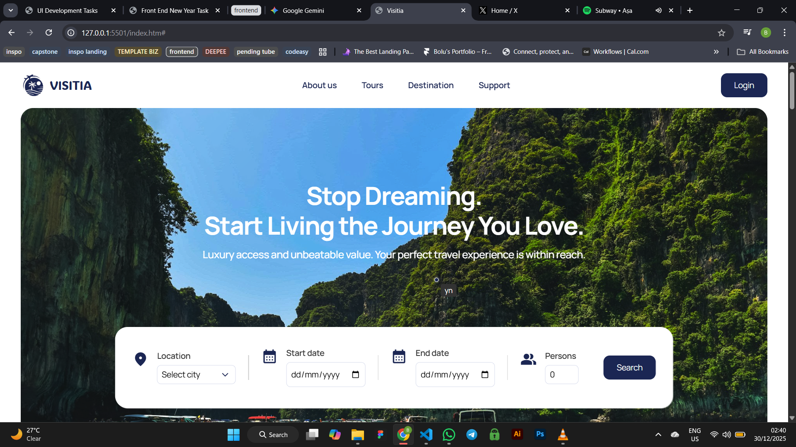

# Visitia-travel-agency
Visitia 🌍
A modern, responsive landing page for a travel agency. Built with a focus on clean UI, smooth states, and a mobile-first approach.

[[Live Demo Link](https://visitia.bolujxlstudio.com/)]

What's inside?
Modern UI: Features glassmorphism, custom-styled forms, and high-quality card layouts.

Fully Responsive: I used a token-based system for spacing and typography so it looks great on everything from an iPhone to a 27-inch monitor.

Pure CSS Logic: Aside from a tiny bit of JS to toggle the mobile menu, all the layout shifts and hover effects are handled with CSS.

The Tech I Used
HTML5 & CSS3: Leveraged CSS Variables (tokens) for easy theme management.

Flexbox & Grid: Used for the destination and tour sections.

Google Fonts: Manrope for readability and Raleway for headings.

Preview

